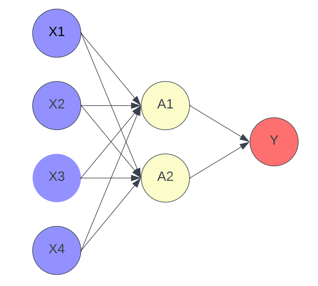
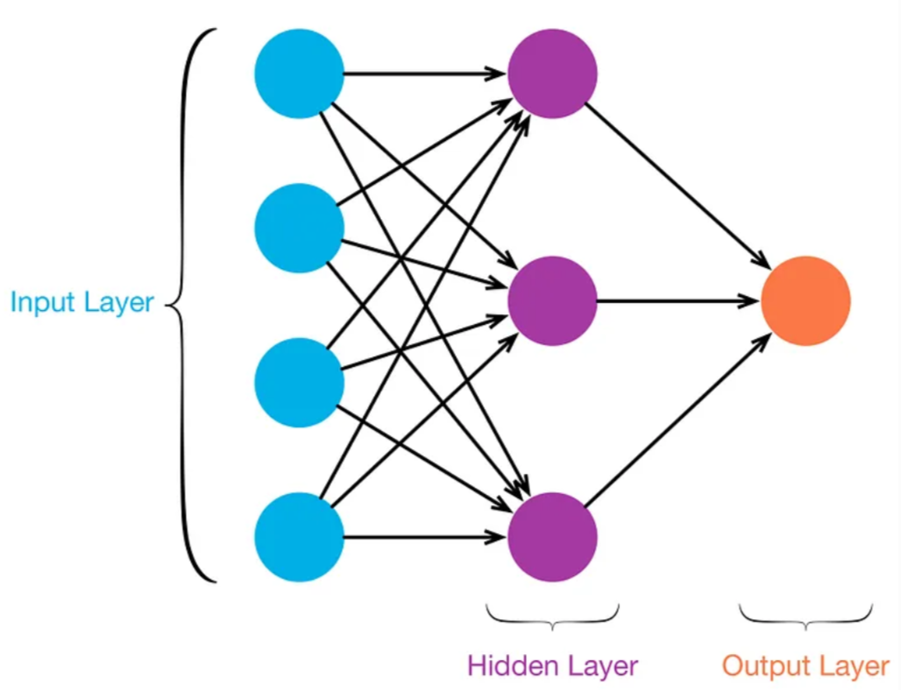
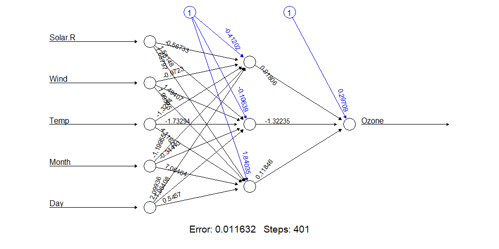
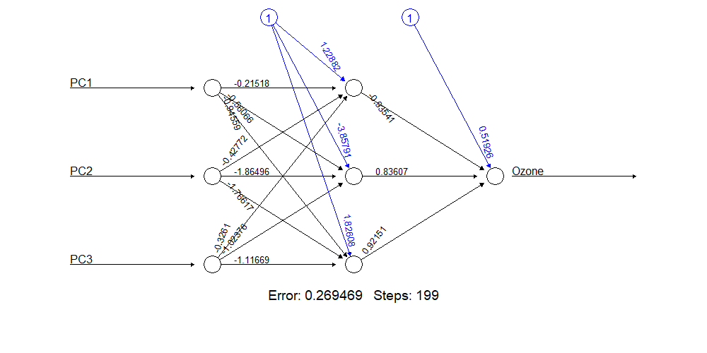
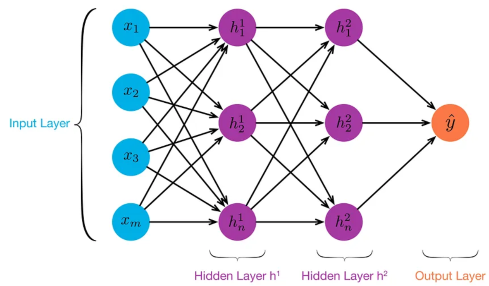
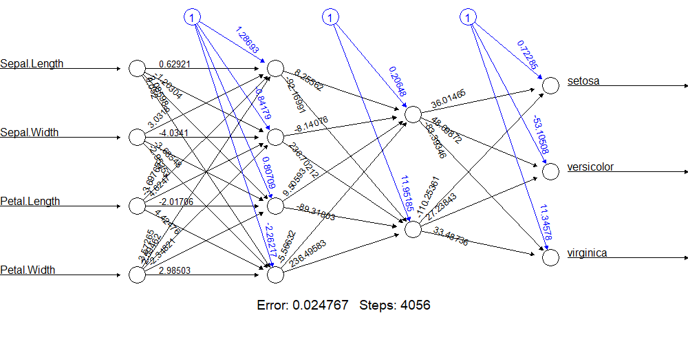
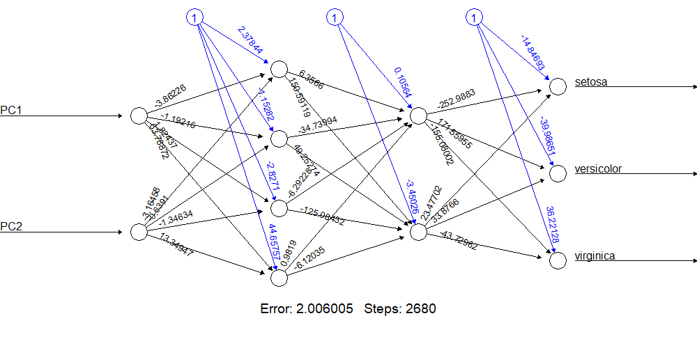

```{r setup, include=FALSE}
knitr::opts_chunk$set(echo = F, message = F, warning = F, out.width = "75%", fig.align = "center")
library(tidyverse)

load("../437-single-layer-neural-nets.Rdata")
```

\tableofcontents
\newpage


# Introduction  

## Deep Learning 

## The Neural Network Model 

A neural network is a type of deep learning algorithm that makes use of a web of nodes to predict or classify data. The complexity of a neural network can vary greatly based on what task is required. As the name suggests, they are similar in function to neurons in a brain. The model takes in information through the _input layer_, which then activates various nodes in the _hidden layers_, and then a result is produced.

### The Input Layer

The input layer is where data can be input into the model. If we have $p$ input variables, which we will denote $X = X_1, X_2, ..., X_p$, then our network will have $p$ input nodes. Each node in future layers will depend on the value that $X_i$ holds. 

### Nonlinear Activation Functions  

Before we get into the hidden layer, it is important to understand what is happening at each hidden layer node. Each hidden layer node is computed by taking a weighted linear combination of the input layer and then applying a _nonlinear activation function_ so that the _activation_, which is the value the node will take based on input vector $X$, will be between 0 and 1.

We will discuss two of the most common activation functions. For simpler networks, the _sigmoid_ function is effective. The sigmoid function is defined as  

$$S(x) = \frac{1}{1 + e^{-x}}$$

As discussed previously, the purpose of the activation function is to bring the range of values for the input layer down to any value between 0 and 1.  

Another activation function that is more common in networks that require more "training" is the rectified linear activation unit function, or ReLU for short. The ReLU function is defined as  

$$R(x)=   \left\{
\begin{array}{ll}
      0 & \text{if x < 0} \\
      x & \text{otherwise} \\
\end{array} 
\right.$$

The benefits of using ReLU over Sigmoid is that ReLU can be better used for _backpropagation_, which is the main technique used to train networks. 

### Hidden Layers  

Hidden layers are the bread and butter of neural network models. Take, for example, the network pictured below with 4 input nodes and 2 hidden nodes.  

```{r fig.cap = "Example of a Simple Neural Network with 4 Input Nodes and 2 Hidden Nodes"}

```

Mathematically, we can write the _activation_ of the 1st node of the hidden layer, $A_1$, as  

$$A_1 = h_k(X) =g(w_{0,1} + \sum_{j=1}^{p}w_{j,1}\cdot X_j)$$  

Where $g(.)$ is the nonlinear activation function of choice and $w_{j,1}$ is the weight associated with activation 1 and input node $j$. The value of $w_{0,1}$ is called the "bias" and can be added to offset the activation so that the minimum value matches what it is expected to be. For each activation of the hidden layer, we are taking a weighted sum of all nodes in the input layer. The activation function restricts the range of the values the activation can hold. For Sigmoid, it would be between 0 and 1 while ReLU would just be greater than or equal to 0. This can be generalized further for $k$ activations  

$$A_k = g(w_{0,k} + \sum_{j=1}^{p}w_{j,k}\cdot X_j)$$

### Output Layer

The output layer is what we would be predicting. For a quantitative response, we would have a single node that would hold the value we predict based on the input vector $X$. For a categorical response with $q$ levels, we would have $q$ output nodes. The output can be thought of as a linear regression model fit using the hidden layer nodes as inputs. This can be formally written as  

$$f(x) = \beta_0 + \sum_{k = 1}^{k}A_k\cdot \beta_k$$

## Applications of Principal Component Analysis with Neural Networks  

Neural networks can grow in complexity very quickly. Given a dataset with 20 input variables, we could end up requiring many nodes in the Hidden Layer. The training process can be timely and computationally expensive.  

Principal Component Analysis would allow for those 20 input variables to be trimmed down to 2 or 3 principal components. This would also theoretically cut down on the number of nodes in the Hidden Layer, thus reducing the computational cost of fitting the model while maintaining the accuracy of the model.  

# Single-Layer Neural Networks  

A Single-Layer Neural Network is a type of _feed forward neural network_, which means information flows in one direction, from input to output, without any feedback loops. In other words, in a feed forward neural network, there are no loops or cyclical connections between nodes.

As the name implies, a Single-Layer Neural Network consists of an input layer, one hidden layer, and the output layer. The input layer, a vector we will call $X$, consists of _p_ variables $X = (X_1, X_2, ..., X_p)$. The neural network builds a nonlinear function $f(X)$ to predict the response $Y$. The nonlinear function $f(X)$ is the output layer. 

To go from the input layer and build the output layer, the neural network creates a hidden layer that computes $k = 1, ..., K$ activations $A_k = h_k(X)$. The activations are nonlinear transformations of linear combinations of the $p$ input variables $X_1, X_2, ..., X_p$. These $h_k(X)$ are not fixed in advance, but rather learned during the training of the network. The $K$ activations from the hidden layer feed into the output layer to create the nonlinear function $f(X)$. 

_Note on K_: $K$ is an arbitrary number chosen by the statistician. Generally, it is advised to chose a value of $K$ that is less than $2p$.

A neural network with a single layer can be visualized as such:
```{r, echo = F, out.width = "350px", fig.align = 'center', fig.cap = "Figure 1:  Single Layer Neural Network. This example has an input layer (blue) that consists of 4 variables. The hidden layer computes 3 activations (purple) that are nonlinear transformations of linear combinations of the input variables. The output layer (orange) is a linear model that uses these activations as inputs, resulting in a function f(X). In this example, there is only one output, but it is possible to have many."}

```

However, if a data set contains a large number of predictor variables - and thus the input layer consists of many neurons - fitting the neural network can quickly become complex. Not only would this potentially require many nodes in the hidden layer, but it may also be computationally expensive. In situations like this, it would be useful to reduce the number of nodes in the input layer.

Principal Component Analysis (PCA) can also be used in conjunction with Single Layer Neural Networks. In this scenario, the investigator begins by conducting PCA on the data. Then, the input layer in the neural network will consist of _q_ principal components, instead of the _p_ variables in the dataset. Here, _q_ < _p_, hence reducing the number of nodes in the input layer.

Thus, if we return the generalized visual example in **Figure 1** above, the four blue neurons of the input layer would represent the first four principal components. It is worth noting that the number of principal components that make up the input layer is not standardized, but rather it should consist of as many as are deemed necessary via principal component analysis prior to building the neural network. 

The contents of the input layer is the main difference between typical Single-Layer Neural Networks and Single-Layer Neural Networks with PCA. The follow steps of conducting a Single-Layer Neural Network remain the same. 


## Example  

For an example of a single-layer network, we used the `airquality` dataset from the `datasets` package in R. We trained a model to predict Ozone levels using the other predictors available. We then trained a model to predict Ozone levels using the first 3 principal components and compared the results.  

```{r}
airquality %>% select(-c(PC1, PC2, PC3)) %>% head(n = 5) %>% knitr::kable()
```


The network using the observed variables in the dataset can be seen below. The network was trained quickly and predicted Ozone levels with 5% error 90% of the time and predicted with 1% error 65% of the time. Impressive!

```{r fig.cap = "Neural network using observed variables to predict Ozone levels"}

```

Comparing those results to the network trained using the first 3 principal components, we got predictions within 5% of the observed values 73% of the time and predictions within 1% of the observed values 62% of the time. The performance of the network using principal components is similar with a 1% error rate but falls behind within a 5% error rate.  

```{r fig.cap = "Neural network using first 3 principal components to predict Ozone levels"}

```

# Multi-Layer Neural Networks 

A Multi-Layer Neural Network relays on the same structure as a Single-Layer Neural Network but typically has more than one hidden layer and many units per layer. While a single hidden layer with a large number of units could approximate most function, using multiple hidden layers with a more modest number of units is easier and more practical.

There will be multiple output variables instead of one. The variables represent a single qualitative variable and are dependent on each other.

A Multi-Layer Neural Network can be visualized as such:
```{r, echo = F, out.width = "350px", fig.align = 'center', fig.cap = "Figure 2:  Multi-Layer Neural Network. This example has an input layer (blue) that consists of 4 variables. The first hidden layer computes 3 activations (purple) and the second hidden layer also computes 3 activations (purple). The output layer (orange) is a linear model that uses these activations as inputs, resulting in a function f(X). This example only has one output, but it is possible to have many."}


```

When building the hidden layers each new layer is build in context of the previous activation. For example, the first hidden layer will look the same as the activations for a Single-Layer Neural Network.

$$A_k^{(1)} = h_k^{(1)}(X) = g(w_{k0}^{(1)} + \sum^{p}_{j=1}w_{kj}^{(1)}X_{j}$$

The next hidden layer treats the activation $A_k^{(1)}$ of the first hidden layer as the inputs for the new activations. Here the activations $A_k^{(1)}$ from the first layer are functions of X.

$$A_l^{(2)} = h_l^{(2)}(X) = g(w_{l0}^{(2)} + \sum^{K_1}_{k=1}w_{lk}^{(2)}A_{k}^{(1)}$$
Each layer continues to use the activations of the layer before to build a a more complex output layer.

Another diffrence between these activation formulas and the one used for Single-Layer is the new super scrips. These indacate which layer the activations and weights belong.

The notation $\bf{W_1}$ represents the entire matrix of weights that feed from the input layer in to the first hidden layer, $L_1$. It has (p + 1) * (# of $L_1$) units. The '+ 1' is to account for the intercept. Each element from the first layer feeds into the second hidden layer, $L_2$, through $\bf{W_1}$. This matrix has (# of $L_1$ + 1) * (# of $L_2$)  units. This pattern continuous on for teach hidden layer. All of these unit weights are stored in matrix $\bf{B}$.

Multi-Layer also puts out a non-linear function to predict the response $Y$. In this case for m = 0, 1, ..., 9:
$$f_m(X) = Z_m = \beta_{m0} + \sum^{K_2}_{l=1}\beta_{ml}h_l^{(2)} = \beta_{m0} + \sum^{K_2}_{l=1}\beta_{ml}A_l^{(2)}$$

A special softmaz activation function can also be used to get the formula:

$$f_m(X) = Pr(Y=m|X) = e^{Zm}/\sum^9_{l=0}e^{X_l}$$

This ensures that all the outputs behave like probabilities.

## Example  

For an example of a multi-layer network, we used the `Iris` dataset from the `datasets` package in R. We trained a model to predict Species using Sepal Length, Sepal Width, Petal Length, and Petal Width and will compare its performance to a model using the first 2 principal components to predict Species.  

```{r}
iris %>% select(-c(PC1, PC2, PC3)) %>% head(n =  5) %>% knitr::kable()
```


The network that uses the 4 observed features of a flower performed well, with an accuracy of 98%. Below we can see the structure of the network.  

```{r fig.cap = "Neural network using observed variables to predict species"}

```

The network using the first 3 principal components also obtaining an accuracy of 98% with species classification, while only taking only $\frac{2}{3}$s of the time to train. We can see that network's structure below.  

```{r fig.cap = "Neural network using first 3 principal components to predict species"}

```

The structure of these networks was the same, so it is unsurprising that the performance was also similar. A takeaway from this example is that PCA can be used to allow for simpler input layers while achieving similar results. When a data set includes thousands of observations to be used for training, reducing the time to train by $\frac{1}{3}$ can make a huge difference.

\newpage

# References  

https://www.datacamp.com/tutorial/neural-network-models-r
