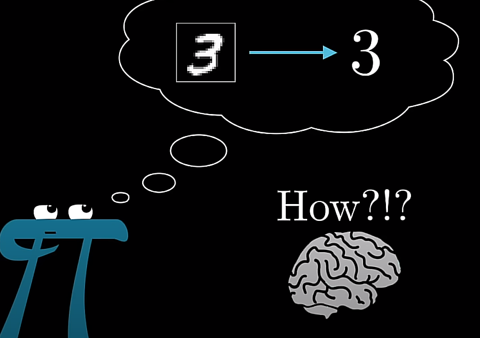

```{r setup, include=FALSE}
knitr::opts_chunk$set(echo = F, message = F, warning = F, out.width = "50%", fig.align = "center")
library(tidyverse)
```

\tableofcontents
\newpage


# Introduction  

## Deep Learning (Becky)

## The Neural Network Model (Eliot)

A neural network is a type of deep learning algorithm that makes use of a web of nodes to predict or classify data. The complexity of a neural network can vary greatly based on what task is required. As the name suggests, they are similar in function to neurons in a brain. The model takes in information through the _input layer_, which then activates various nodes in the _hidden layers_, and then a result is produced.

### The Input Layer

The input layer is where data can be input into the model. If we have $p$ input variables, which we will denote $X = X_1, X_2, ..., X_p$, then our network will have $p$ input nodes. Each node in future layers will depend on the value that $X_i$ holds. 

### Nonlinear Activation Functions  

Before we get into the hidden layer, it is important to understand what is happening at each hidden layer node. Each hidden layer node is computed by taking a weighted linear combination of the input layer and then applying a _nonlinear activation function_ so that the _activation_, which is the value the node will take based on input vector $X$, will be between 0 and 1.

We will discuss two of the most common activation functions. For simpler networks, the _sigmoid_ function is effective. The sigmoid function is defined as  

$$S(x) = \frac{1}{1 + e^{-x}}$$

As discussed previously, the purpose of the activation function is to bring the range of values for the input layer down to any value between 0 and 1.  

Another activation function that is more common in networks that require more "training" is the rectified linear activation unit function, or ReLU for short. The ReLU function is defined as  

$R(x)=   \left\{
\begin{array}{ll}
      0 & \text{if x < 0} \\
      x & \text{otherwise} \\
\end{array} 
\right.$

The benefits of using ReLU over Sigmoid is that ReLU can be better used for _backpropagation_, which is the main technique used to train networks. We will get more into this later.

### Hidden Layers  

Hidden layers are the bread and butter of neural network models. Take, for example, the network pictured below with 4 input nodes and 2 hidden nodes.  

```{r fig.cap = "Example of a Simple Neural Network with 4 Input Nodes and 2 Hidden Nodes"}
knitr::include_graphics("hidden_layer_example.png")
```

Mathematically, we can write the _activation_ of the 1st node of the hidden layer, $A_1$, as  

$$A_1 = g(w_{0,1} + \sum_{j=1}^{p}w_{j,1}\cdot X_j)$$  

Where $g(.)$ is the nonlinear activation function of choice and $w_{j,1}$ is the weight associated with activation 1 and input node $j$. The value of $w_{0,1}$ is called the "bias" and can be added to offset the activation so that the minimum value matches what it is expected to be. For each activation of the hidden layer, we are taking a weighted sum of all nodes in the input layer. The activation function restricts the range of the values the activation can hold. For Sigmoid, it would be between 0 and 1 while ReLU would just be greater than or equal to 0. This can be generalized further for $k$ activations  

$$A_k = g(w_{0,k} + \sum_{j=1}^{p}w_{j,k}\cdot X_j)$$

### Output Layer

The output layer is what we would be predicting. For a quantitative response, we would have a single node that would hold the value we predict based on the input vector $X$. For a categorical response with $q$ levels, we would have $q$ output nodes. The output can be thought of as a linear regression model fit using the hidden layer nodes as inputs. This can be formally written as  

$$f(x) = \beta_0 + \sum_{k = 1}^{k}A_k\cdot \beta_k$$

## Training Neural Networks  

Unlike regression models, coefficients used to predict values are not generated through Maximum Likelihood Estimation. Instead, the weights ($w_{i,j}$) are chosen through a process called _backpropagation_. Before we get into that, we should go over some other components of network training.  

A popular example is a model that predicts what digit is drawn in a grid, example pictured below [@3blue1brown].  

```{r 3blue1brown-example-graphic, fig.cap = "Example of Predicting a Number from a Hand Drawn Digit"}

```

If we input a drawing of a 3, but our network predicts it to be a 3, 5, or 9 (those output nodes would have the highest activations), we want to be able to "correct" the network. This can be done by using a _cost function_. A cost function sums up the squared differences in the activations of the nodes with what we want them to be. If we want the prediction to be a 3, we want $Y_3 = 1.00$ and $Y_1 = Y_2 = Y_4 = ... = Y_{10} = 0.00$. Lets say $Y_3$, $Y_5$, and $Y_9$, the output nodes associated with 3, 5, and 9, respectively, are actually equal to 0.4, 0.3, and 0.3, while the rest are close to 0. We would take the sum of the differences squared, resulting in the cost of that prediction.   

```{r cost-table, fig.cap = "Example Table of Costs of Different Activation Predictions"}
tibble(Digit = c(1, 2, 3, 4, 5, 6, 7, 8, 9, 0),
       Predicted = c(0.01, 0.02, 0.40, 0.01, 0.30, 0.01, 0.02, 0.03, 0.30, 0.01),
       Actual = c(0, 0, 1, 0, 0, 0, 0, 0, 0, 0),
       Cost = c("(0 - 0.01)^2", "(0 - 0.02)^2", "(1 - 0.40)^2", "(0 - 0.01)^2", "(0 - 0.30)^2", "(0 - 0.01)^2", "(0 - 0.02)^2", "(0 - 0.03)^2", "(0 - 0.30)^2", "(0 - 0.01)^2")) %>% knitr::kable()
```

Once we know the cost of a prediction, we can calculate the change in the cost with respect to the change in any activation $A$ or weight $w$ using the chain rule. For example, if we were interested in how the cost $C$ changes based on changes in the weight $w$, we would get    

$$\frac{\delta C}{\delta w} = \frac{\delta z}{\delta w}\cdot \frac{\delta A}{\delta z}\cdot \frac{\delta C}{\delta A}$$  

Where $z$ is the weighted linear combination of inputs nodes, such that $A = g(z)$. In order to efficiently adjust the weights in the network, the algorithm known as backpropagation is used to find the gradient of the cost $\nabla C$, which then allows us to find the negative gradient $-\nabla C$, which will tell us which weights need to be changed in order to move in the direction of decreasing cost. This process repeats until we get a minimum.

# Single-Layer Neural Networks (Harley)  

## Example  

# Multi-Layer Neural Networks (Natasha)

## Example  

\newpage

# References  

https://www.datacamp.com/tutorial/neural-network-models-r
